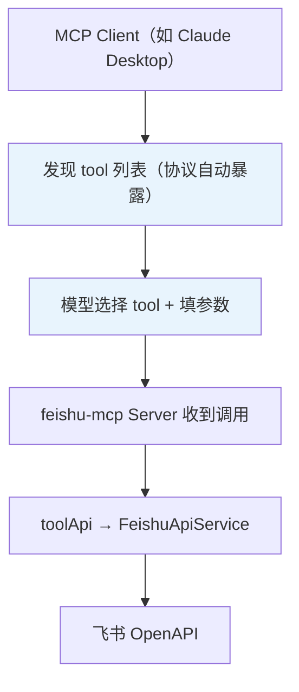
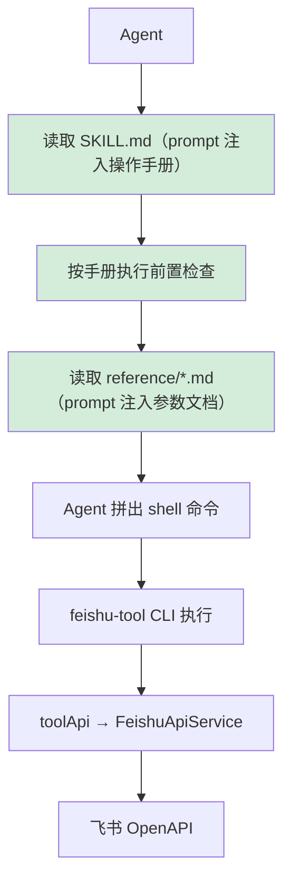

# MCP vs Skill：两种让 Agent 使用外部能力的方式——以飞书为例

> [!info] 仓库地址
> - MCP Server + CLI：[cso1z/Feishu-MCP](https://github.com/cso1z/Feishu-MCP)
> - Skill：[cso1z/Feishu-Skill](https://github.com/cso1z/Feishu-Skill)

## 先看全景：三层架构

```
┌──────────────────────────────────────────────────────────────────┐
│  第 3 层：Agent 使用协议层                                          │
│  feishu-skill/SKILL.md + reference/*.md                          │
│  → 往 Agent 上下文注入的是：自然语言的操作流程 + 工具参考文档            │
├──────────────────────────────────────────────────────────────────┤
│  第 2 层：能力暴露层（两种壳，同一个内核）                              │
│  ┌───────────────────────┐  ┌──────────────────────────────┐     │
│  │ feishu-mcp            │  │ feishu-tool                  │     │
│  │ MCP Server            │  │ CLI 命令行                    │     │
│  │ → 往上下文注入的是：     │  │ → 不注入上下文                 │     │
│  │   tool name           │  │   只是被 shell 调用            │     │
│  │   + description       │  │                              │     │
│  │   + JSON Schema       │  │                              │     │
│  └──────────┬────────────┘  └──────────────┬───────────────┘     │
│             └──────────┬───────────────────┘                     │
├────────────────────────┼─────────────────────────────────────────┤
│  第 1 层：能力实现层    ▼                                        │
│  toolApi → FeishuApiService → 领域 Service → 飞书 OpenAPI        │
└──────────────────────────────────────────────────────────────────┘
```

> [!abstract] 一句话总结
> MCP 和 Skill 都是让 Agent 能操作飞书，区别在于"模型怎么知道该调什么、怎么调"——==MCP 通过协议注入结构化的 tool 定义，Skill 通过 prompt 注入自然语言的操作手册==。

---

## 三条调用路径

### MCP 路径



### Skill + CLI 路径



> [!tip] 关键区别
> MCP 路径中，模型通过协议"自动发现"工具；Skill 路径中，模型通过"阅读文档"获知工具用法，然后自己拼 shell 命令。

---

## MCP 往上下文注入了什么

当 MCP Client 连上 `feishu-mcp` Server 后，模型的上下文里会多出一批 **tool 定义**。每个 tool 有三部分：**名称**、**描述**、**参数 Schema**。

以 `create_feishu_document` 为例，下面是源码中实际注册的内容：

### 源码：tool 注册（documentTools.js）

```javascript
// 文件：modules/document/tools/documentTools.js

server.tool(
  // ① tool 名称
  'create_feishu_document',

  // ② tool 描述（这段英文会完整注入模型上下文）
  'Creates a new Feishu document and returns its information. '
  + 'Supports two modes: '
  + '(1) Feishu Drive folder mode: use folderToken to create a document in a folder. '
  + '(2) Wiki space node mode: use wikiContext with spaceId (and optional parentNodeToken) '
  + 'to create a node (document) in a wiki space. '
  + 'IMPORTANT: In wiki spaces, documents are nodes themselves...'
  + 'Only one mode can be used at a time - provide either folderToken OR wikiContext, not both.',

  // ③ 参数 Schema（Zod 定义，序列化为 JSON Schema 注入上下文）
  {
    title: DocumentTitleSchema,           // z.string().describe('Document title...')
    folderToken: FolderTokenOptionalSchema, // z.string().optional().describe('Folder token...')
    wikiContext: WikiSpaceNodeContextSchema, // z.object({spaceId, parentNodeToken?})
  },

  // ④ handler（这部分不注入上下文，只在服务端执行）
  async ({ title, folderToken, wikiContext }) => {
    const result = await createDocument({ title, folderToken, wikiContext }, feishuService);
    return { content: [{ type: 'text', text: JSON.stringify(result, null, 2) }] };
  }
);
```

### 模型实际"看到"的（序列化后）

当 MCP Client 向模型传递 tool 列表时，上面的注册会变成类似这样的结构：

```json
{
  "name": "create_feishu_document",
  "description": "Creates a new Feishu document and returns its information. Supports two modes: (1) Feishu Drive folder mode: use folderToken... (2) Wiki space node mode: use wikiContext...",
  "inputSchema": {
    "type": "object",
    "properties": {
      "title": {
        "type": "string",
        "description": "Document title (required)."
      },
      "folderToken": {
        "type": "string",
        "description": "Feishu Drive folder token (optional). The token of the target folder."
      },
      "wikiContext": {
        "type": "object",
        "description": "Wiki space context (optional). Provide spaceId and optional parentNodeToken.",
        "properties": {
          "spaceId": { "type": "string", "description": "Wiki space ID..." },
          "parentNodeToken": { "type": "string", "description": "Parent node token..." }
        },
        "required": ["spaceId"]
      }
    },
    "required": ["title"]
  }
}
```

### MCP 注入的全部 tool 清单

实际注册的 tool 共 20 个（`feishuMcp.js` 通过 `ModuleRegistry` 动态加载）：

| 模块 | tool 数量 | 认证要求 | 包含的 tools |
|------|----------|---------|-------------|
| document | 15 | tenant 即可 | `create_feishu_document`, `get_feishu_document_info`, `get_feishu_document_blocks`, `search_feishu_documents`, `batch_create_feishu_blocks`, `batch_update_feishu_block_text`, `delete_feishu_document_blocks`, `create_feishu_table`, `get_feishu_image_resource`, `upload_and_bind_image_to_block`, `get_feishu_whiteboard_content`, `fill_whiteboard_with_plantuml`, `get_feishu_root_folder_info`, `get_feishu_folder_files`, `create_feishu_folder` |
| task | 4 | user 模式 | `list_feishu_tasks`, `create_feishu_task`, `update_feishu_task`, `delete_feishu_task` |
| member | 1 | user 模式 | `get_feishu_users` |

---

## Skill 往上下文注入了什么

Skill 走的是完全不同的路线：==不通过协议注册 tool，而是把一整份操作手册作为 prompt 注入模型上下文。==

### 源码：SKILL.md 文件头（frontmatter）

```yaml
# 文件：~/.codex/skills/feishu-skill/SKILL.md

---
name: feishu-skill
version: 1.4.0
description: 使用 feishu-tool CLI 操作飞书文档、任务、用户等资源。
  当用户需要读写飞书时调用此 skill。
allowed-tools: Read, Bash(feishu-tool *), Bash(command -v feishu-tool),
  Bash(npm install -g feishu-mcp@latest), Bash(node -e *)
---
```

这段 frontmatter 声明了：
- **何时触发**：用户需要操作飞书时
- **允许调什么**：只允许 `Read` 和特定的 `Bash` 命令（`feishu-tool *`）
- **不允许直接调飞书 API**——必须通过 `feishu-tool` CLI

### 源码：五步执行流程（SKILL.md 正文核心）

```markdown
## 执行流程

每次调用前，按以下顺序检查，任一步骤不满足则停止并提示用户：

### 第一步：检查命令是否可用
feishu-tool --help
- 报错 → 执行 npm install -g feishu-mcp@latest，再重新验证

### 第二步：检查版本是否满足要求
要求 ≥ 0.3.1，不满足则升级

### 第三步：检查是否已完成初始化配置
feishu-tool config
- FEISHU_APP_ID 或 FEISHU_APP_SECRET 为 (未设置) → 调用 feishu-tool guide，停止执行

### 第四步（仅 user 模式）：检查授权状态
feishu-tool auth
- isValid: true → 继续
- isValid: false, canRefresh: true → SDK 自动刷新，无需操作
- isValid: false, canRefresh: false → 告知用户需授权，每 10 秒轮询，最多 5 分钟

### 第五步：选择工具并读取参考文档
在调用任何工具前，必须先读取对应模块的参考文档：
- Document 工具 → reference/document.md
- Task 工具    → reference/task.md
- Member 工具  → reference/member.md
- CLI 命令     → reference/cli.md
```

### 源码：reference 文档里写了什么（以 document.md 为例）

reference 文档是 Skill 的"参数手册"，它的详细程度远超 MCP 的 Schema describe：

```markdown
# 文件：reference/document.md（节选）

## 共用说明

- **documentId**：文档 ID 或普通文档 URL，支持 https://xxx.feishu.cn/docx/xxx
  或直接传 token。⚠️ 不支持 Wiki URL，Wiki 需先调 get_feishu_document_info。

- **parentBlockId**：父块 ID，必填，不可省略。三种常见场景：
  | 场景           | documentId   | parentBlockId           |
  |---------------|-------------|------------------------|
  | 写入文档根级    | doc_token   | doc_token（与 documentId 相同）|
  | 更新表格单元格  | doc_token   | 单元格子块 ID（children[0]）   |
  | 写入嵌套块内    | doc_token   | 父块的 block_id              |

**文本样式字段区分**（高频错误来源）：
| 操作   | 工具                         | 字段名       |
|-------|------------------------------|------------|
| 创建块 | batch_create_feishu_blocks    | textStyles |
| 更新块 | batch_update_feishu_block_text | textElements|
记忆法：create 用 Styles，update 用 Elements。切勿混用。
```

```markdown
# reference/document.md（工具参数示例节选）

### create_feishu_document

**参数：**
- title* string：文档标题
- folderToken? string：云盘文件夹 token
- wikiContext? WikiContext

> folderToken 与 wikiContext 二选一。

### batch_create_feishu_blocks

**参数：**
- documentId*
- parentBlockId*（根级写入时 = documentId）
- index*（0-based，标题块不计入）
- blocks* BlockConfig[]

BlockConfig 结构：
| blockType    | options                                            |
|-------------|---------------------------------------------------|
| text        | {text: {textStyles: TextElement[], align?: 1|2|3}} |
| heading     | {heading: {level: 1~9, content: string}}           |
| code        | {code: {code: string, language?: number}}          |
| image       | {image: {width?, height?}}                         |
| mermaid     | {mermaid: {code: string}}                          |
```

```markdown
# reference/document.md（常见工作流节选）

### 工作流 1：创建文档并填充内容

# 1. 获取根文件夹 token
feishu-tool get_feishu_root_folder_info

# 2. 创建文档
feishu-tool create_feishu_document '{"title":"项目方案","folderToken":"<root_token>"}'

# 3. 批量插入内容块
feishu-tool batch_create_feishu_blocks '{
  "documentId": "<doc_id>",
  "parentBlockId": "<doc_id>",
  "index": 0,
  "blocks": [
    {"blockType":"heading","options":{"heading":{"level":1,"content":"背景"}}},
    {"blockType":"text","options":{"text":{"textStyles":[{"text":"项目背景说明..."}]}}}
  ]
}'
```

### 模型实际"看到"的

当 Skill 被触发后，Agent 上下文中会按需加载：

1. **SKILL.md 全文**（~240 行）：执行流程、工具速查表、错误处理指南
2. **对应的 reference 文档**（Agent 在第五步用 `Read` 工具读入）：
   - `reference/document.md`（~620 行）：15 个工具的完整参数 + 7 个工作流
   - `reference/task.md`（~210 行）：4 个工具 + 3 个工作流
   - `reference/member.md`（~110 行）：1 个工具 + 2 个工作流

---

## 为什么两条路能殊途同归

MCP 注册 tool 时附带了 description 和 schema，但 CLI 的 dispatcher 里**完全没有这些信息**——它只是一个 `工具名 → handler 函数` 的平铺映射：

```javascript
// 文件：cli/dispatcher.js

const MODULE_REGISTRY = {
    document: {
        authType: 'tenant',
        tools: {
            // 没有 description，没有 schema，只有函数引用
            create_feishu_document:      (p, s) => createDocument(p, s),
            get_feishu_document_info:    (p, s) => getDocumentInfo(p, s),
            get_feishu_document_blocks:  (p, s) => getDocumentBlocks(p.documentId, s),
            search_feishu_documents:     (p, s) => searchDocuments(p, s),
            batch_create_feishu_blocks:  (p, s) => batchCreateBlocks(p, s),
            // ... 省略其余
        },
    },
    task: {
        authType: 'user',
        tools: {
            create_feishu_task: (p, s) => createTasks(p.tasks, s),
            // ...
        },
    },
    member: {
        authType: 'user',
        tools: {
            get_feishu_users: (p, s) => getUsers(p, s),
        },
    },
};
```

两条路在 toolApi 层汇合：

```
MCP:  server.tool handler  ──┐
                              ├──→ createDocument() → FeishuApiService → 飞书 OpenAPI
CLI:  dispatcher handler   ──┘
```

共享：`toolApi`、`FeishuApiService`、所有领域 Service、`BaseApiService`、认证/缓存/配置。

**这也解释了为什么 Skill 需要 reference 文档——==CLI 本身不携带任何参数说明==，模型如果不读 reference，就不知道参数该怎么传。**

---

## 总结对比

|  | MCP | Skill |
|---|---|---|
| **模型怎么知道有哪些工具** | 协议自动暴露 tool 列表 | 读 SKILL.md 里的工具速查表 |
| **模型怎么知道参数格式** | JSON Schema（Zod → 序列化） | 读 reference/*.md 文档 |
| **tool description 语言** | 英文（硬编码在 server.tool 调用里） | 中文（写在 SKILL.md + reference 里） |
| **前置检查（安装/配置/授权）** | 无，Server 端自行处理 | 有，Skill 要求 Agent 一步步检查 |
| **模型的调用方式** | 输出 tool_use JSON | 拼 `feishu-tool <name> '<json>'` shell 命令 |
| **注入上下文的内容量** | ~20 个 tool 定义（name + desc + schema） | SKILL.md 240 行 + reference 约 1000 行 |
| **底层实现** | 共享同一套 toolApi → FeishuApiService | 共享同一套 toolApi → FeishuApiService |

> [!tip] 选择建议
> 宿主支持 MCP 就用 MCP（协议自动发现，调用简洁）；不支持 MCP 但能跑 Shell 就用 Skill（prompt 指导 + CLI 间接实现）；需要强制前置检查流程也选 Skill。

---

## 附录：关键源码位置

> [!info] 相关阅读
> - [[mcp_intro|MCP 协议详解]]
> - [[skill_intro|Skills 资料整理]]

> 路径相对于 npm 包根目录 `feishu-mcp/`

| 文件 | 作用 |
|---|---|
| `dist/mcp/feishuMcp.js` | MCP Server 入口，动态注册 tool |
| `dist/modules/document/tools/documentTools.js` | document 模块 tool 注册（name + description + schema + handler） |
| `dist/types/documentSchema.js` | Zod Schema 定义（序列化为 JSON Schema 注入上下文） |
| `dist/cli/dispatcher.js` | CLI 工具名 → handler 映射表（无 description / schema） |
| `dist/services/feishuApiService.js` | 共享业务层总门面 |
| `~/.codex/skills/feishu-skill/SKILL.md` | Skill 主文件（操作流程 + 工具速查表） |
| `~/.codex/skills/feishu-skill/reference/*.md` | 各模块工具的完整参数 + 工作流 |
